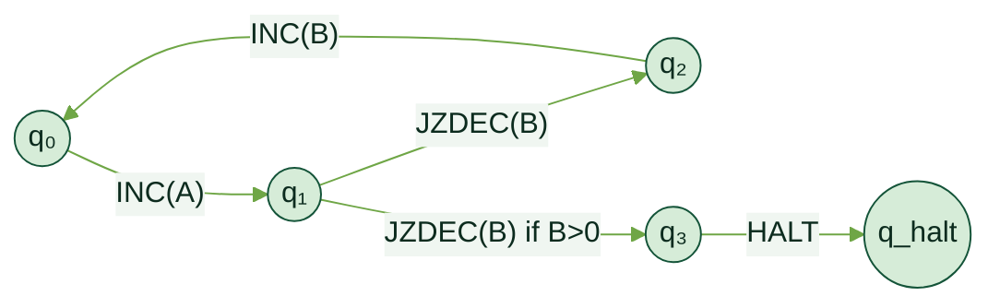
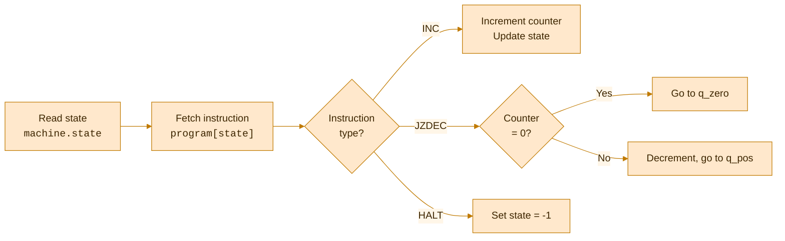
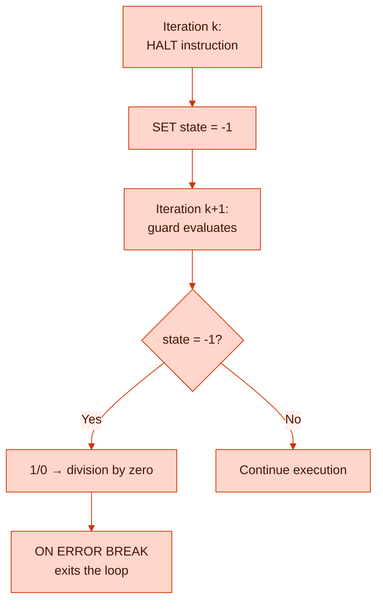

<!-- _class: lead -->


# Cypher is Turing-Complete
### A Formal Proof via 2-Counter Machine Simulation

Pierre Halftermeyer · Neo4j

---

## Agenda

1. **The Claim** — What we're proving and why it matters
2. **2-Counter Machines** — The computational model
3. **Encoding in Cypher** — Program, state, simulation
4. **The Simulation** — `reduce()` as a universal executor
5. **Correctness** — Inductive proof
6. **The Bounded-Step Objection** — And two resolutions
7. **Primitives Used** — What Cypher features suffice
8. **Corollaries** — Halting problem, practical implications, and beyond

---

<!-- _class: lead periwinkle -->

# 1. The Claim

---

## Theorem

> **CYPHER 25**, restricted to a single `RETURN` statement with `reduce()`, list comprehensions, and `CASE` expressions, **is Turing-complete**.

---

## Proof Strategy

We prove Turing-completeness by **reduction**:

$$
\text{Turing Machine} \;\xrightarrow{\text{Minsky 1967}}\; \text{2-Counter Machine} \;\xrightarrow{\text{this proof}}\; \text{Cypher } \texttt{reduce()}
$$

- 2-counter machines are known to be Turing-complete [Minsky, 1967]
- We show Cypher can simulate **any** 2-counter machine
- Therefore Cypher is Turing-complete

---

<!-- _class: lead forest -->

# 2. 2-Counter Machines

---


<!-- _class: dense -->
## Definition

A **2-counter machine** $M = (Q,\; q_0,\; q_{\text{halt}},\; \delta)$ consists of:

| Component | Meaning |
|---|---|
| $Q$ | Finite set of states |
| $q_0 \in Q$ | Initial state |
| $q_{\text{halt}} \in Q$ | Halting state |
| $\delta : Q \to \text{Instructions}$ | Transition function |

Each instruction is one of:

- $\texttt{INC}(c, q')$ — increment counter $c \in \{A, B\}$, go to state $q'$
- $\texttt{JZDEC}(c, q_z, q_p)$ — if $c = 0$ go to $q_z$, else decrement $c$ and go to $q_p$

---

## Why 2-Counter Machines?

**Fact** [Minsky 1967]: For any Turing machine $T$, there exists a 2-counter machine $M$ that simulates $T$.

They are the **simplest** known Turing-complete model:

- Only **2 unbounded integers** (counters A and B)
- Only **2 instruction types** (INC and JZDEC)
- A finite-state controller

If Cypher can simulate this, it can simulate **anything**.

---



**Example**: a 4-state program that increments A, tests B, loops or halts.

---

<!-- _class: lead marigold -->

# 3. Encoding in Cypher

---

## Program Encoding

Encode the transition function $\delta$ as a Cypher **list of maps**:

```cypher
LET program = [
  {state: 0, op: 'INC',   counter: 'A', next: 1},
  {state: 1, op: 'JZDEC', counter: 'B', q_zero: 2, q_pos: 3},
  {state: 2, op: 'INC',   counter: 'B', next: 0},
  {state: 3, op: 'HALT',  counter: '',  next: 3}
]
```

- A **finite, static** list — no graph writes needed
- `program[i]` gives $\delta(q_i)$ in O(1)

---

## Machine State

The full machine configuration $(q,\; c_A,\; c_B)$ is a single Cypher **map**:

```cypher
{state: 0, A: 0, B: 0}
```

<div style="display: flex; gap: 2rem;">
<div>

### Configuration
- `state` — current state index
- `A` — counter A value
- `B` — counter B value

</div>
<div>

### Convention
- `state = -1` means **halted**
- Counters are non-negative integers
- Initial: `{state: 0, A: 0, B: 0}`

</div>
</div>

---

<!-- _class: lead hibiscus -->

# 4. The Simulation
### `reduce()` as a Universal Executor

---

<!-- _class: dense -->

## The Core Simulation

<div class="columns">
<div>

```cypher
CYPHER 25
LET program = [ /* ... as above ... */ ]
LET max_steps = 1000000  // arbitrary bound (see §6)

LET result = reduce(
  machine = {state: 0, A: 0, B: 0},
  step IN range(1, max_steps) |
  CASE WHEN machine.state = -1
    THEN machine  // halted: identity
  ELSE
    // head([v IN [expr] | ...]) — let-binding idiom
    head([instr IN [program[machine.state]] |
      CASE instr.op
        WHEN 'INC' THEN
          CASE instr.counter
            WHEN 'A' THEN
              {state: instr.next,
               A: machine.A + 1, B: machine.B}
            WHEN 'B' THEN
              {state: instr.next,
               A: machine.A, B: machine.B + 1}
          END
```

</div>
<div>

```cypher
        WHEN 'JZDEC' THEN
          CASE instr.counter
            WHEN 'A' THEN
              CASE WHEN machine.A = 0
                THEN {state: instr.q_zero,
                      A: 0, B: machine.B}
                ELSE {state: instr.q_pos,
                      A: machine.A - 1, B: machine.B}
              END
            WHEN 'B' THEN
              CASE WHEN machine.B = 0
                THEN {state: instr.q_zero,
                      A: machine.A, B: 0}
                ELSE {state: instr.q_pos,
                      A: machine.A, B: machine.B - 1}
              END
          END
        WHEN 'HALT' THEN
          {state: -1, A: machine.A, B: machine.B}
      END
    ])
  END
)
RETURN result
```

</div>
</div>

---

## How It Works

Each iteration of `reduce()` performs **one machine step**:



---

## Key Idiom: Let-Binding in `reduce()`

`LET` is **not available** inside `reduce()`. The workaround:

```cypher
// This is a let-binding idiom:
head([instr IN [program[machine.state]] |
  // 'instr' is now bound — use it freely
  CASE instr.op WHEN 'INC' THEN ... END
])
```

- Wraps the expression in a **single-element list** `[expr]`
- Comprehension **binds** the variable name
- `head()` unwraps the result

---

<!-- _class: lead forest -->

# 5. Correctness Proof

---

## Induction on Steps

**Claim**: After $k$ iterations of `reduce()`, the value of `machine` equals the configuration of machine $M$ after $k$ steps.

**Base case** ($k = 0$):

$$\texttt{machine} = \{state: 0,\; A: 0,\; B: 0\} = \text{initial configuration of } M \quad \checkmark$$

---


<!-- _class: dense -->
## Inductive Step

Assume after $k$ iterations: $\texttt{machine} = \{state: q_k,\; A: a_k,\; B: b_k\}$ matches $M$'s configuration.

At iteration $k+1$, the `reduce()` body:

1. Looks up `program[machine.state]` $\to$ retrieves instruction $\delta(q_k)$
2. Executes via `CASE`:

| Instruction | Cypher returns | Matches $M$? |
|---|---|---|
| $\texttt{INC}(A, q')$ | $\{state: q',\; A: a_k + 1,\; B: b_k\}$ | $\checkmark$ |
| $\texttt{JZDEC}(A, q_z, q_p)$, $a_k = 0$ | $\{state: q_z,\; A: 0,\; B: b_k\}$ | $\checkmark$ |
| $\texttt{JZDEC}(A, q_z, q_p)$, $a_k > 0$ | $\{state: q_p,\; A: a_k - 1,\; B: b_k\}$ | $\checkmark$ |
| $\texttt{HALT}$ | $\{state: -1, \ldots\}$ — identity thereafter | $\checkmark$ |

Symmetric cases for counter B. $\square$

---

<!-- _class: lead hibiscus -->

# 6. The Bounded-Step Objection

---

## The Problem

The `reduce()` proof uses `range(1, max_steps)` — a **finite** bound.

Strict Turing-completeness requires **unbounded** computation.

**Two resolutions:**

| Approach | Mechanism | Achieves |
|---|---|---|
| §6.1 `IN TRANSACTIONS` | Loop up to $2^{63}$ steps | Practically unbounded |
| §6.2 Sufficiency argument | Set bound = halting time | Universal for total functions |

---

<!-- _class: dense -->

## 6.1 Resolution via IN TRANSACTIONS

```cypher
CYPHER 25
CREATE (:Machine {state: 0, A: 0, B: 0});

UNWIND range(1, 9223372036854775807) AS step  // 2^63 - 1
CALL (step) {
  MATCH (m:Machine)
  WITH m, $program[m.state] AS instr
  // Halt guard: fires BEFORE any SET when state = -1
  WITH m, instr, CASE WHEN m.state = -1 THEN 1/0 ELSE 1 END AS guard
  SET m.state = CASE instr.op
    WHEN 'INC' THEN instr.next
    WHEN 'JZDEC' THEN CASE instr.counter
      WHEN 'A' THEN CASE WHEN m.A = 0 THEN instr.q_zero ELSE instr.q_pos END
      WHEN 'B' THEN CASE WHEN m.B = 0 THEN instr.q_zero ELSE instr.q_pos END
      END
    WHEN 'HALT' THEN -1 END,
  m.A = CASE WHEN instr.op = 'INC' AND instr.counter = 'A' THEN m.A + 1
        WHEN instr.op = 'JZDEC' AND instr.counter = 'A' AND m.A > 0 THEN m.A - 1
        ELSE m.A END,
  m.B = CASE WHEN instr.op = 'INC' AND instr.counter = 'B' THEN m.B + 1
        WHEN instr.op = 'JZDEC' AND instr.counter = 'B' AND m.B > 0 THEN m.B - 1
        ELSE m.B END
} IN TRANSACTIONS OF 1 ROW
  ON ERROR BREAK
```

---


<!-- _class: dense -->
## Termination Mechanism



**Note**: $2^{63} \approx 9.2 \times 10^{18}$ steps exceeds any physically realizable computation. True theoretical unboundedness would require an external client-side restart loop.

---

## 6.2 Sufficiency Argument

For any Turing machine $T$ on input $w$ that halts in $f(|w|)$ steps:

$$\texttt{max\_steps} = f(|w|) \implies \texttt{reduce()} \text{ correctly simulates } T \text{ on } w$$

Since:
- Every **decidable** language $L$ has a decider $T_L$ that halts on all inputs
- For each $T_L$, there exists a computable bound $f$
- Cypher `reduce()` with `range(1, f(|w|))` correctly decides $L$

This shows Cypher is **computationally universal for total functions**. The gap with full Turing-completeness concerns only non-halting computations (addressed by §6.1).

---

<!-- _class: lead periwinkle -->

# 7. Required Primitives

---

## What Cypher Features Suffice?

| Primitive | Role in the proof |
|---|---|
| `reduce()` | Fold over a list — provides **iteration** |
| `CASE WHEN` | **Conditional branching** |
| Integer `+1`, `-1`, `= 0` | **Counter operations** |
| Map `{state, A, B}` | Machine **state representation** |
| List indexing `program[i]` | **O(1) instruction lookup** |
| `head([v IN [expr] \| ...])` | Let-binding (convenience only) |

**No graph operations. No APOC. No GDS.**

Pure Cypher expressions suffice.

---

<!-- _class: lead marigold -->

# 8. Corollaries

---

<!-- _class: hibiscus -->

## Practical Implications

Cypher can compute **any computable function**, including:

- **VM / interpreter** — `reduce(state, step IN range | execute(state, program[state.ip]))`
- **tree search** — nested `reduce()` with pruning
- **Gaussian elimination** — matrix as list-of-lists, pivoting via `reduce()`
- **Cellular automata** — grid state as flat list, generation via `reduce()`

Empirically validated: **150+ Advent of Code puzzles** solved in pure Cypher (2015–2025).

---

<!-- _class: invert -->

## Summary

| | |
|---|---|
| **Theorem** | CYPHER 25 with `reduce()` is Turing-complete |
| **Method** | Simulation of 2-counter machines (Minsky 1967) |
| **Primitives** | `reduce()`, `CASE`, integers, maps, list indexing |
| **Bounded-step** | Resolved by `IN TRANSACTIONS` ($2^{63}$ steps) and sufficiency argument |

---

<!-- _class: neutral -->

## References

- Minsky, M.L. (1967). *Computation: Finite and Infinite Machines*. Prentice-Hall.
- Neo4j Documentation: [Cypher Manual](https://neo4j.com/docs/cypher-manual/current/)
- Advent of Code Cypher Solutions (2015–2025) — 150+ solved algorithmic problems [github](https://github.com/halftermeyer)

---

<!-- _class: lead -->


# Cypher is Turing-Complete
### Pure expressions. No graph ops. No APOC. No GDS.

**neo4j.com**
