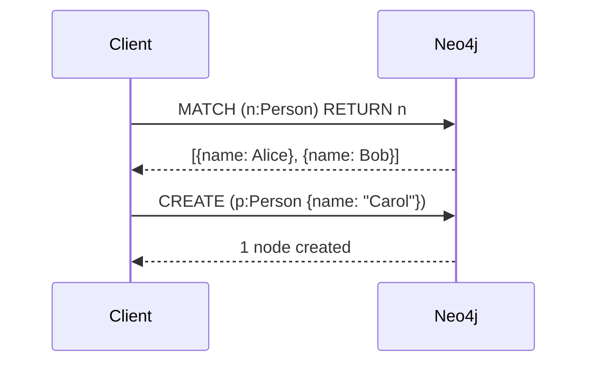
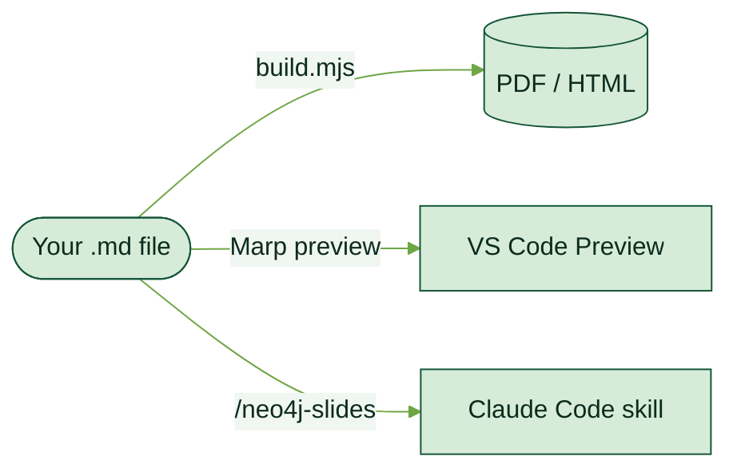

<!-- _class: lead -->


# Neo4j Marp Template
### A guide to graph-native slides — brand, tooling, and AI generation

---

## Agenda

1. **What is this template?** — purpose and stack
2. **Quick start** — clone, install, build
3. **Slide classes** — layout and palette
4. **Content elements** — Cypher, Mermaid, math, images
5. **Palette-aware diagrams** — matching Mermaid colors to slide palette
6. **The Claude Code skill** — AI-generated decks in one command

---

<!-- _class: lead -->

# What Is This Template?

---

## A Branded Slide System for Neo4j Content


Built on **Marp** — Markdown-to-slides — with the full Neo4j Needle design system baked in.

- Neo4j brand colors, fonts (Syne + Public Sans), and spacing
- **Cypher syntax highlighting** — applied at build time via `highlightjs-cypher`
- **Mermaid diagrams** — rendered to inline SVG
- **KaTeX math** — inline `$…$` and block `$$…$$`
- **Per-slide palette classes** — 5 accent palettes, combinable with layout classes
- VS Code preview via the Marp extension

> **One theme, one repo** — drop a `.md` into `decks/` and run `npm run pdf`.

---

<!-- _class: dense -->

## Stack at a Glance

| Layer | Tool | Role |
|---|---|---|
| Slide engine | `@marp-team/marp-cli` | Markdown → HTML / PDF / PPTX |
| Cypher highlight | `highlightjs-cypher` | Syntax color at build time |
| Diagram renderer | `@mermaid-js/mermaid-cli` | Mermaid → inline SVG |
| Math | KaTeX (built into Marp) | `$inline$` and `$$block$$` |
| Theme | `neo4j.css` | Neo4j Needle brand tokens |
| Build script | `build.mjs` | Orchestrates all preprocessing |

```
repo/
├── decks/          ← your .md files go here
├── examples/       ← reference and tutorial decks
├── assets/         ← logo, node shapes, images
├── neo4j.css       ← Neo4j brand theme
├── build.mjs       ← single build entry point
└── mermaid.config.json  ← Neo4j-branded Mermaid theme
```

---

<!-- _class: lead -->

# Quick Start

---

<!-- _class: dense -->

## Clone, Install, Build

```bash
git clone https://github.com/halftermeyer/neo4j-marp-template.git
cd neo4j-marp-template
npm install
```

Drop your deck into `decks/` and build:

```bash
npm run pdf          # all decks/*.md → *.pdf
npm run html         # all decks/*.md → *.html
npm run pptx         # all decks/*.md → *.pptx
npm run preview      # browser live preview
```

Build a single file:

```bash
npm run pdf -- decks/my-talk.md
node build.mjs decks/my-talk.md --pdf
```

---

<!-- _class: lead -->

# Slide Classes

---

<!-- _class: dense -->

## Layout Classes

Apply with an HTML comment **before** the slide content:

```markdown
<!-- _class: lead -->
```

| Class | Effect | When to use |
|---|---|---|
| `lead` | Dark background, large white title | Opening, section breaks, closing |
| `invert` | Dark blue background, accent headings | Key takeaways, emphasis |
| `dense` | Reduced font (20 px), tighter spacing | Long code listings, many bullets |
| _(none)_ | White background, colored headings | Regular content slides |

> **Rule of thumb:** use `lead` and `invert` sparingly — they lose impact if overused.

---

<!-- _class: dense -->

## Palette Classes

Override the accent color on individual slides. **Space-separate** with layout classes:

| Class | Primary color | When to use |
|---|---|---|
| _(none)_ | Baltic blue `#0A6190` | Default — core Neo4j content |
| `forest` | Forest green `#145439` | Sustainability, growth, partnerships |
| `marigold` | Amber `#C07A00` | Energy, innovation, premium content |
| `hibiscus` | Coral `#D43300` | Bold claims, high-energy topics |
| `periwinkle` | Blue-violet `#6A82FF` | AI/ML, future tech, digital |
| `neutral` | Warm gray `#4F4E4D` | Appendix, reference, subdued content |

```markdown
<!-- _class: invert forest -->    ← dark green section break
<!-- _class: lead hibiscus -->    ← bold coral title slide
<!-- _class: dense periwinkle --> ← AI code slide, blue-violet accent
```

---

<!-- _class: periwinkle -->

## Palette in Action — Periwinkle

Blue-violet accent applied by adding `periwinkle` to the class:

```cypher
MATCH (e:Entity)-[:RELATED_TO]->(ctx:Context)
WHERE e.embedding IS NOT NULL
RETURN e.name, ctx.summary
ORDER BY gds.similarity.cosine(e.embedding, $query) DESC
LIMIT 5
```

- Headings and `## titles` render in blue-violet
- `**bold**` renders in the palette's accent color
- List markers, borders, and dividers follow the palette

---

<!-- _class: lead -->

# Content Elements

---

<!-- _class: dense -->

## Cypher Code Blocks

Use ` ```cypher ` — syntax highlighting applied at build time.

```cypher
MATCH (p:Person)-[:KNOWS]->(friend:Person)
WHERE p.name = "Alice" AND friend.age > 25
RETURN friend.name AS name, friend.age AS age
ORDER BY age DESC
LIMIT 5
```

- Keywords (`MATCH`, `WHERE`, `RETURN` …) — **cyan**
- Node labels and relationship types — **light green**
- String literals — **marigold**

*Keep code blocks to 7 lines on normal slides. Use `<!-- _class: dense -->` or split across slides for longer queries.*

---

<!-- _class: dense -->

## Mermaid Diagrams

Use ` ```mermaid ` — rendered to inline SVG at build time.



Supported types: `graph`, `sequenceDiagram`, `classDiagram`, `flowchart`, `gantt`, `pie`

*Keep diagrams simple — max ~6 nodes or ~6 steps for readability on a slide.*

---

<!-- _class: dense -->

## Math and Images

**KaTeX math** — inline and block:

Inline: the PageRank of node $u$ with damping $d$ and $N$ total nodes.

$$
PR(u) = \frac{1-d}{N} + d \sum_{v \in B_u} \frac{PR(v)}{L(v)}
$$

**Images** — place in `assets/`, reference with `../assets/`:

```markdown
    <!-- inline, resized -->
  <!-- right-half background -->
      <!-- full-slide background -->
```

---

<!-- _class: lead forest -->

# Palette-Aware Mermaid Diagrams

---

<!-- _class: dense forest -->

## Matching Diagram Colors to the Slide Palette

Mermaid SVGs are pre-rendered at build time — they don't inherit CSS palette classes automatically. Use the `%%{init: ...}%%` directive to override colors per diagram.



The `%%{init}%%` line is the **first line** inside the mermaid block. Reference colors for all 5 palettes are in `SLIDE_PROMPT.md`.

---

<!-- _class: lead -->

# The Claude Code Skill

---

## What Is the `/neo4j-slides` Skill?

A **Claude Code skill** that generates a complete, branded Marp slide deck from a topic description — and builds it to PDF automatically.

<div style="display:flex; gap:2rem;">
<div>

### What it does
- Generates the `.md` deck from `SLIDE_PROMPT.md` + reference deck
- Auto-detects overflowing slides and adds `dense` where needed
- Copies `assets/` alongside the deck

</div>
<div>

### What you get
- A ready-to-edit `.md` file
- A rendered `.pdf` alongside it
- An `assets/` folder with logo and node shapes
- No manual Marp setup needed

</div>
</div>

---

<!-- _class: dense -->

## Installing the Skill

From inside the repo root, run:

```bash
REPO=$(git rev-parse --show-toplevel)
mkdir -p ~/.claude/skills/neo4j-slides/examples
cp "$REPO/claude-tools/skills/neo4j-slides/SKILL.md" ~/.claude/skills/neo4j-slides/
cp "$REPO/SLIDE_PROMPT.md"                            ~/.claude/skills/neo4j-slides/
cp "$REPO/examples/slides.md"                         ~/.claude/skills/neo4j-slides/examples/
```

The skill lives in `~/.claude/skills/neo4j-slides/` and is available in any Claude Code session.

To re-sync after updates (e.g. after pulling new commits):

```bash
REPO=$(git rev-parse --show-toplevel)
cp "$REPO/claude-tools/skills/neo4j-slides/SKILL.md" ~/.claude/skills/neo4j-slides/
cp "$REPO/SLIDE_PROMPT.md"                            ~/.claude/skills/neo4j-slides/
cp "$REPO/examples/slides.md"                         ~/.claude/skills/neo4j-slides/examples/
```

---

<!-- _class: dense -->

## Using the Skill

In any Claude Code session, invoke with `/neo4j-slides` followed by a topic:

```
/neo4j-slides GraphRAG — grounding LLMs with knowledge graphs
/neo4j-slides Fraud detection with Neo4j for financial services
/neo4j-slides Neo4j GDS algorithms: PageRank, Louvain, Node2Vec
```

Claude will:
1. Generate a structured `.md` deck with appropriate palette classes
2. Build it to PDF in your current directory
3. Report the output paths

> **Tip:** the more specific the topic, the better the output. Include audience, tone, or section ideas in the prompt if you have them.

---

<!-- _class: dense -->

## Using SLIDE_PROMPT.md Standalone

`SLIDE_PROMPT.md` is a self-contained **LLM system prompt**. Use it directly with any model:

- Paste it as a system prompt in Claude.ai, ChatGPT, or any LLM chat
- Provide a topic and get a complete `.md` file back
- Drop the output into `decks/` and run `npm run pdf`

It documents every slide class, palette, color token, Cypher convention, Mermaid pattern, and anti-pattern — enough for any capable model to generate a correct deck without further context.

```
SLIDE_PROMPT.md  →  system prompt
your topic       →  user message
output .md       →  drop into decks/ → npm run pdf
```

---

<!-- _class: lead -->

# Start Building

### Clone · Prompt · Present

[github.com/halftermeyer/neo4j-marp-template](https://github.com/halftermeyer/neo4j-marp-template)

*Community template · Not official Neo4j material*
