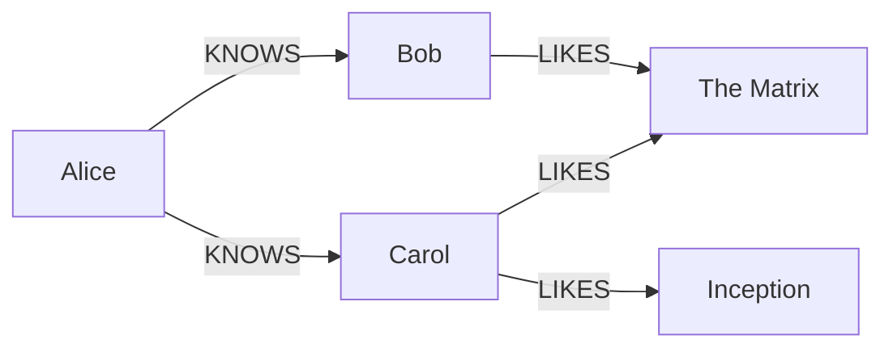
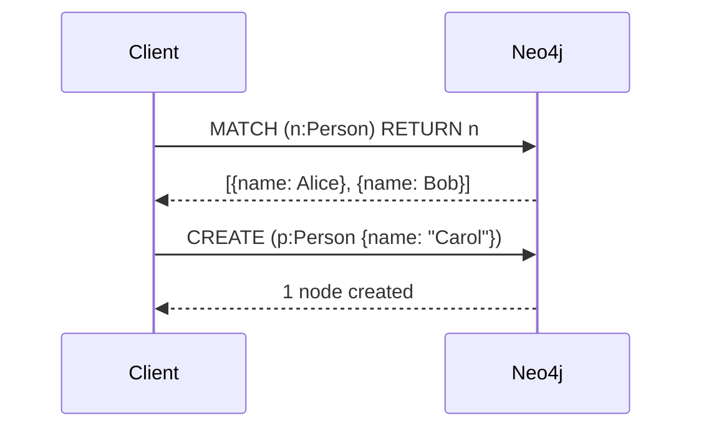
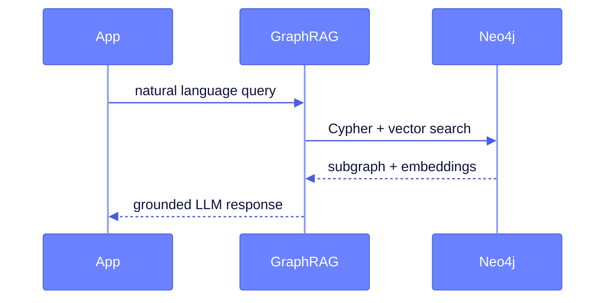
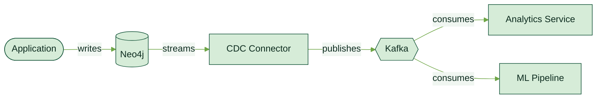

<!-- _class: lead -->


# Neo4j Template for Marp
### Graph-native slides · Neo4j brand · Markdown-first

John Doe · john.doe@neo4j.com

---

## What's in this template?

- **Neo4j brand theme** — colors, fonts, and layout from the Needle design system
- **Cypher syntax highlighting** — auto-applied at build time
- **Mermaid diagrams** — rendered to SVG (`graph`, `sequenceDiagram`, and more)
- **KaTeX math** — inline and block equations
- **Per-slide palette classes** — `forest`, `marigold`, `hibiscus`, `periwinkle`, `neutral`
- **VS Code preview** — with the Marp extension

---

## Cypher Code Block

```cypher
MATCH (p:Person)-[:KNOWS]->(f:Person)
WHERE p.name = "Alice" AND f.age > 25
RETURN f.name AS friend, f.age
ORDER BY f.age DESC
LIMIT 10
```

Keywords in **cyan** · Node labels in **light green** · Strings in **marigold**

---

<!-- _class: dense -->

## Dense Slide — Long Code Listing

```cypher
// Find fraud rings: people sharing identity documents
MATCH (p1:Person)-[:HAS_DOC]->(doc:Document)<-[:HAS_DOC]-(p2:Person)
WHERE p1 <> p2
WITH doc, collect(DISTINCT p1) + collect(DISTINCT p2) AS suspects
WHERE size(suspects) > 2
UNWIND suspects AS s
MATCH (s)-[:MADE]->(txn:Transaction)
WHERE txn.amount > 5000
  AND txn.createdAt > datetime() - duration({days: 30})
WITH s, doc, sum(txn.amount) AS totalExposure
ORDER BY totalExposure DESC
RETURN s.name AS suspect,
       doc.number AS sharedDoc,
       totalExposure
LIMIT 20
```

---

## Two-Column Layout

<div style="display: flex; gap: 2rem;">
<div>

### Graph database
- Nodes & relationships
- Schema-optional
- Index-free adjacency

</div>
<div>

### Relational database
- Tables & foreign keys
- Fixed schema
- JOIN-based traversal

</div>
</div>

---

## Image & Quote


> "Relationships are a first-class citizen in Neo4j — not an afterthought."
> — Neo4j engineering

---

## Math — Inline & Block

Inline math: the edge weight between nodes $u$ and $v$ is $w(u,v) \in \mathbb{R}^+$.

Block (display) math — PageRank formula:

$$
PR(u) = \frac{1-d}{N} + d \sum_{v \in B_u} \frac{PR(v)}{L(v)}
$$

Shortest path cost over a graph $G=(V,E)$:

$$
\delta(s,t) = \min_{p \in P(s,t)} \sum_{(u,v) \in p} w(u,v)
$$

---

## Mermaid — Graph Diagram



---

## Mermaid — Sequence Diagram



---

<!-- _class: invert -->

## Invert — Table Example

| Feature | Neo4j | RDBMS |
|---|---|---|
| Data model | Property graph | Tables & foreign keys |
| Relationships | First-class, typed | JOIN at query time |
| Schema | Optional, flexible | Required, rigid |
| Query language | Cypher | SQL |
| Best for | Connected data | Tabular / aggregate |

> **Rule of thumb:** if your queries are mostly traversals, reach for a graph.

---

<!-- _class: lead -->

# Per-slide Palette Classes
### Override accent colors on individual slides — no theme switch needed

---


<!-- _class: dense -->
## Palette Classes — Reference

Apply a palette class alongside layout classes (`lead`, `invert`, `dense`):

| Class | Primary color | Best for |
|---|---|---|
| _(none)_ | Baltic blue `#0A6190` | Default — core Neo4j content |
| `forest` | Forest green `#145439` | Sustainability, growth, partnerships |
| `marigold` | Amber `#C07A00` | Energy, innovation, premium content |
| `hibiscus` | Coral `#D43300` | Bold claims, high-energy topics |
| `periwinkle` | Blue-violet `#6A82FF` | AI/ML, future tech, digital |
| `neutral` | Warm gray `#4F4E4D` | Appendix, reference, subdued content |

```markdown
<!-- _class: invert forest -->
<!-- _class: lead hibiscus -->
```

---

<!-- _class: forest -->

## Forest — Content Slide

Green accents signal **sustainability**, **growth**, or **ecosystem** topics.

- Partner integrations and ecosystem content
- Data lineage and supply chain graphs
- Environmental impact tracking

> **Use `forest`** when the topic has a natural or growth-oriented theme.

---

<!-- _class: invert forest -->

## Forest — Invert Slide

Dark forest background for **section emphasis** within a green-themed section.

- Headings render in light green
- Bold text renders in marigold — **key term**
- List markers use the mid-green accent

> **Takeaway:** combine `invert forest` for section break emphasis.

---

<!-- _class: marigold -->

## Marigold — Content Slide

Golden accents for **energy**, **innovation**, or **premium** positioning.

- Partner-branded decks and co-sell content
- Innovation and product launch messaging
- ROI and business value storytelling

> **Use `marigold`** to convey warmth, confidence, or premium quality.

---

<!-- _class: invert marigold -->

## Marigold — Invert Slide

Amber-dark background for high-impact marigold section breaks.

- Headings render in golden yellow
- Strong call-to-action slides
- Revenue and business metrics emphasis

> **Takeaway:** `invert marigold` pairs well with financial or commercial sections.

---

<!-- _class: lead marigold -->

# Marigold Lead Slide
### A warm, bold title slide variant

Use `lead marigold` for a section opener with an amber-dark background instead of the default navy.

---

<!-- _class: hibiscus -->

## Hibiscus — Content Slide

Coral/red accents for **bold**, **high-energy**, or **disruptive** topics.

- Threat detection and fraud use cases
- Breaking changes or migration warnings
- Competitive differentiation claims

> **Use `hibiscus`** when you need urgency, energy, or a strong contrast moment.

---

<!-- _class: invert hibiscus -->

## Hibiscus — Invert Slide

Deep red background for maximum visual impact within a bold section.

- Incident response and security content
- Key risk or challenge slides
- Strong call-to-action with urgency

> **Takeaway:** reserve `invert hibiscus` for the highest-stakes moments in the deck.

---

<!-- _class: periwinkle -->

## Periwinkle — Content Slide

Blue-violet accents for **AI/ML**, **future tech**, or **digital transformation** topics.

- GraphRAG and LLM integration content
- Graph Data Science algorithms
- Agentic and generative AI use cases

```cypher
MATCH (e:Entity)-[:RELATED_TO]->(context:Context)
WHERE e.embedding IS NOT NULL
RETURN e.name, context.summary
ORDER BY gds.similarity.cosine(e.embedding, $query) DESC
LIMIT 5
```

---

<!-- _class: invert periwinkle -->

## Periwinkle — Invert Slide

Deep indigo background for AI/ML section emphasis.

- Headings render in lavender blue
- Ideal for architecture diagrams and technical deep-dives
- Neural network and embedding content

> **Takeaway:** `invert periwinkle` anchors AI/ML sections with a distinct visual identity.

---

<!-- _class: periwinkle -->

## Periwinkle — Mermaid Diagram



---

<!-- _class: neutral -->

## Neutral — Reference Slide

Warm gray accents for **appendix**, **legal**, or **archival** content.

| Slide class | Use case |
|---|---|
| `forest` | Sustainability, growth, partnerships |
| `marigold` | Energy, premium, innovation |
| `hibiscus` | Bold, high-energy, alerts |
| `periwinkle` | AI/ML, future tech |
| `neutral` | Appendix, reference, legal |

*This slide class is intentionally subdued — it does not compete with main content.*

---

<!-- _class: forest -->

## Forest — Mermaid Diagram

Use the `%%{init: ...}%%` directive to match diagram colors to the slide palette.



---

<!-- _class: lead -->

# Start Building
### Replace `slides.md` with your content and run `npm run pdf`

**neo4j.com** · Community template · Not official Neo4j material
